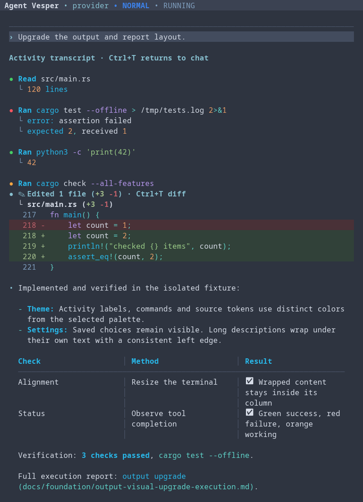

> **Controlled RRC acceptance repository.** Test workflow failures and releases are validation artifacts. Use [the official Agent Vesper repository](https://github.com/99percentgrip/agent-vesper) for installation and supported releases.

<div align="center">

# Agent Vesper

**An AI coding agent for your terminal and editor. Built in Rust.**

[](https://github.com/99percentgrip/agent-vesper/releases/latest)
[](https://github.com/99percentgrip/agent-vesper/actions/workflows/ci.yml)
[](LICENSE)

[Get started](#install) · [Capabilities](#what-you-can-do) · [Update](#update-or-uninstall) · [Documentation](docs/README.md) · [Releases](https://github.com/99percentgrip/agent-vesper/releases)

</div>

Agent Vesper reads your codebase, edits files, runs commands and tests, and remembers project context across conversations. Work in its native terminal interface or connect it to an editor through the Agent Client Protocol (ACP).

Choose **Z.ai, OpenAI, or local models through LM Studio**. Vesper runs on your machine; prompts and relevant context go to the model provider you select. Local model inference requires a running LM Studio server.

## What you can do

| Capability | What it means for your work |
|---|---|
| **Work on real code** | Explore repositories, make changes, run tests, and review results with tool-permission controls. |
| **Follow the work clearly** | Colored activity, live status dots, expandable command output, syntax-colored diffs with line numbers, and aligned reports in the native terminal. |
| **Plan and track tasks** | Review a plan and follow progress in the terminal or your editor. Unfinished plans trigger bounded continuation. |
| **Keep project knowledge** | Save preferences and project facts, search memory, and control what belongs to one project or follows you across projects. |
| **Check completion against requirements** | Enable enforced completion in Settings. The agent recognizes and remembers the task’s requirements document; current verification evidence is required before completion. Missing or failing checks stay visible. |
| **Review visual work** | Use VesperLens to review local HTML artifacts in a browser and return annotations or answers to planning questions. |
| **Use the web when needed** | Enable contained fetching, scraping, crawling, and browser interaction from Settings. Requires Docker or Podman. |
| **Find skills for your task** | Describe the work naturally. Optional model-assisted routing chooses from eligible skill summaries while preserving your full library. Available as a preview in Settings → Skills. [Setup and controls](docs/skills.md). |
| **Extend your workflow** | Connect MCP tools and enable reasoning or multi-worker workflows when a task needs them. |

<details>
<summary><strong>Preview the terminal output</strong></summary>



Example captured from Vesper’s renderer with sample activity. Running dots blink
orange; completed tools show green for success or red for failure. Use **Ctrl+T**
to expand activity output and diffs. Six themes are available in Settings.

</details>

**Try the skill-routing preview:** open **Settings → Skills**, enable
**Model-assisted selection**, then choose **Save changes** when leaving Settings.
It uses your configured provider and adds latency and usage. Standard routing stays
the default, and your skill files remain intact. [Learn more](docs/skills.md).

[Explore the user guide →](docs/using-vesper.md)

## Install

Prebuilt packages include **both the terminal app and the ACP editor server**. You do not need Rust or Python for ordinary coding tasks.

**Supported:** Linux x86_64 / ARM64, macOS Intel / Apple Silicon, and Windows x86_64.

### macOS and Linux

Run in your terminal:

```sh
curl -fsSL https://raw.githubusercontent.com/99percentgrip/agent-vesper/main/scripts/install.sh | sh
```

### Windows

Run in PowerShell:

```powershell
irm https://raw.githubusercontent.com/99percentgrip/agent-vesper/main/scripts/install.ps1 | iex
```

The installer downloads the latest release and verifies its SHA-256 checksum. Reopen your terminal if the commands are not yet on PATH.

[Inspect the installers](scripts/) · [Manual download](https://github.com/99percentgrip/agent-vesper/releases/latest) · [Installation and troubleshooting](docs/installation.md)

## First run

From the project you want to work on:

```sh
cd path/to/your-project
agent-vesper-tui
```

Complete the authentication screen. On the welcome screen, open **Settings** to
choose your provider, model, permissions, and theme, then select **Start coding**.
During a conversation, use **`/settings`** to return to these controls.

When you leave Settings after making ordinary changes, choose **Save changes**,
**Discard changes**, or **Keep editing**. Provider setup has its own confirmation;
restart when prompted.

| Provider | What you need |
|---|---|
| **Z.ai** | A Z.ai API key and access to the selected model/plan. |
| **OpenAI** | An API key or an eligible ChatGPT subscription sign-in. [OpenAI setup](docs/openai-provider.md). |
| **LM Studio** | A running LM Studio server with a loaded model. Configure its address and model in Vesper's provider settings. |

Try a concrete first task:

> Read this repository and explain how to run its tests. Do not change any files yet.

Then ask for a change, review tool approvals, and inspect the result. Use `/help` for commands and `/usage` for the active model, context estimate, and available account usage information.

### Install in Zed

Use the included `agent-vesper-acp` server as a custom external agent. Follow the [Zed setup guide](docs/zed.md) for configuration and persistent chat history.

## Dependencies

Start with the app and your chosen provider. Add dependencies only for the features you use:

- **Project tooling:** Git, compilers, package managers, and test runners needed by your repository.
- **Web tools and container workers:** Docker or Podman, running with Linux containers. The browser-driver image is included in Vesper's package. See the [setup guide](docs/installation.md#web-tools-and-container-workers) for guided setup and platform validation status.
- **Voice input:** Optional Linux/macOS dictation with a visible record/stop control, progress, and retry. See [voice setup](docs/installation.md#voice-input).

[Dependency installation and feature setup →](docs/installation.md#optional-dependencies)

## Update or uninstall

**Update from the app:** on the welcome screen, choose **Check for updates →
Install update** and confirm. Vesper shows installation progress and tells you
when to close and reopen it. Restart any running editor agents too. On Windows,
the installer runs in a separate console after Vesper closes.

You can also rerun the installer above. Updates verify the package checksum and
preserve co-located user state and existing skill edits.
[Update details and version selection](docs/installation.md#update-or-choose-a-version).

**Uninstall:** back up data stored inside the application bundle first, including global memory at its default Linux/macOS location. The uninstaller removes that directory; provider credentials are preserved. [Paths and backup details](docs/installation.md#uninstall).

macOS / Linux:

```sh
curl -fsSL https://raw.githubusercontent.com/99percentgrip/agent-vesper/main/scripts/uninstall.sh | sh
```

Windows PowerShell:

```powershell
irm https://raw.githubusercontent.com/99percentgrip/agent-vesper/main/scripts/uninstall.ps1 | iex
```

## Documentation

| Start here | Learn more |
|---|---|
| [Install, update, dependencies, uninstall](docs/installation.md) | [Web tools and browser setup](docs/web-tools.md) |
| [Using Vesper: memory, commands, verification](docs/using-vesper.md) | [OpenAI authentication and usage](docs/openai-provider.md) |
| [Skills and automatic routing](docs/skills.md) | [Connect to Zed](docs/zed.md) |
| [Browse documentation](docs/README.md) | [Architecture and engineering documentation](docs/README.md#for-contributors) |

[Browse all documentation →](docs/README.md)

## Contribute

Found a bug or have a feature request? [Open an issue](https://github.com/99percentgrip/agent-vesper/issues). Code and documentation contributions are welcome—start with [Contributing](CONTRIBUTING.md).

If Vesper is useful to you, a GitHub star helps others discover it.

[Apache-2.0 licensed](LICENSE).
